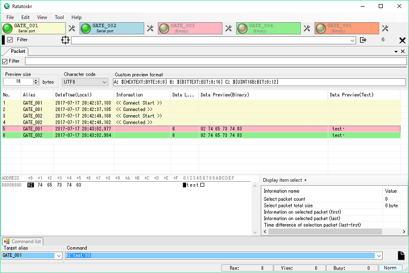

Ratatoskr can monitor and tie various devices and protocols.

## Getting Started

### Prerequisites

* Windows 7
* Windows 8/8.1
* Windows 10

__ and __

* .NET Framework 4.7

### Installing

#### Install
Extract it to an arbitrary directory before using it.

#### Uninstall
Delete the file decompressed by installation.
Please delete [(Users) / AppData / Roaming / Ratatoskr].

## Screenshots

## Authors

* **H.Kouno** - *Initial work* - (https://github.com/tokihk)

See also the list of [contributors](https://github.com/your/project/contributors) who participated in this project.

## License
GNU GENERAL PUBLIC LICENSE v3

## Acknowledgments

* Hat tip to anyone who's code was used
* Inspiration
* etc