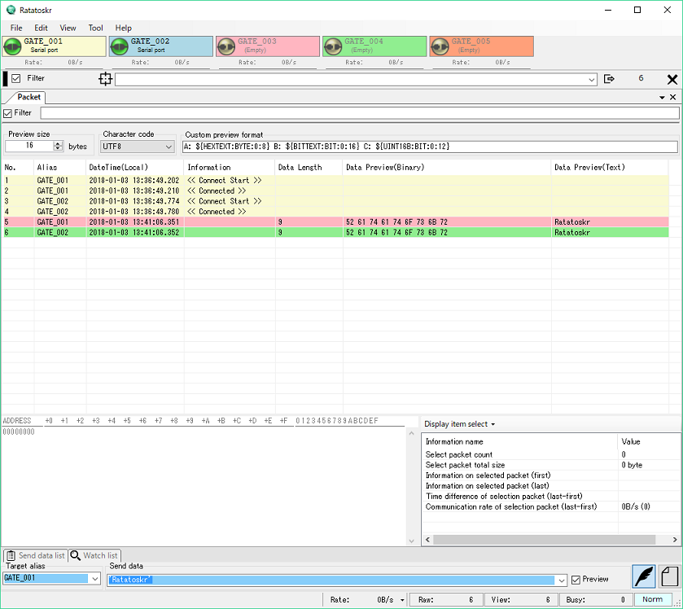
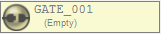
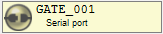
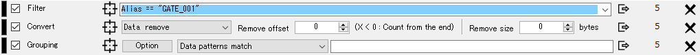

 

# Ratatoskr User's Manual

https://github.com/tokihk/Ratatoskr

Ratatoskr is a development support tool that can communicate with various devices that can be connected to a personal computer.
It provides a general-purpose communication debugging environment for various communication ports such as serial port and TCP /UDP.

You can intuitively operate input /output to /from ports by easy-to-view packet view and interface that emphasizes operability.

Ratatoskr has the following features.

* Supports various communication such as serial port, TCP /IP, UDP
  * Serial Port
  * TCP/IP Server or Client
  * UDP
  * USB Capture
* Supports packet view according to usage, such as packet unit and data unit
* Simultaneous connection to multiple ports
* Simultaneous display of multiple types of packet views
* Saving /loading /saving packet logs automatically
* Real-time packet control such as filtering, packet combining
* Redirect transfer from port to port

## Copyright

* Toki.H.K ([https://github.com/tokihk](https://github.com/tokihk))

## license

GPL 3 (GNU GENERAL PUBLIC LICENSE v 3)

## Operating environment

* .NET Framework 4.7

## Installation

After installing .NET Framwork, decompress it to an arbitrary folder and execute it. 
Other software is required when using some functions.

| Features | Required Software |
|:---|:---|
| USB Monitor | USBPcap ([http://desowin.org/usbpcap/](http://desowin.org/usbpcap/"USBPcap"))|
| Ehernet | WinPcap ([https://www.winpcap.org/](https://www.winpcap.org/))|

### Uninstall

Ratatoskr does not use the registry. 
Delete the file decompressed by installation, delete the configuration file. 
The configuration file exists in the following location. 
`%APPDATA%\Ratatoskr`

## Basic usage

### 1.Add packet view

You can add any packet view from `[Menu Bar]->[View]->[Add packet view]`.

#### 2.Set the gate

You can set the gate from the button of the gate bar.

| Icon | state | operation method |
| :---: | :---: | --- |
|  | Not set | Mouse Left /Right click:Gate edit |
|  | Configured | Left mouse click:Connect /disconnect Mouse right click:Gate edit Mouse right hold:Gate reset | -|

| Icon | State |
|:---:|:---:|
|| Connection status |
|| Preparing for connection |
|| Disconnected state |

#### 3.Send

Data can be sent from the transmission control box at the bottom of the frame.

The destination gate is specified with `wild card 'in`Target alias`.

*  **Edit transmission mode**

    Enter in hexadecimal notation and send with Enter key.
    It recognizes it as a separate data with the 3rd character or space.

    Enclose it with `'...'`to convert the enclosed character to character code.
    You can change the character code by enclosing it with `<...>`.(Default is utf-8)

    If you check `Preview`, you can check the data actually sent.

    | Input data | Transmission data |
    | :--- | :--- |
    | `0123456789`|`01 23 45 67 89 `|
    | `0 1 2 3 4`|`00 01 02 03 04`|
    | `02'test '03` | `02 74 65 73 74 03 `|
    | `02 'あいうえお'03 ` | `02 E 3 81 82 E 3 81 84 E 3 81 86 E 3 81 88 E 3 81 8 A 03` |
    | `02 <shift-jis>'あいうえお'03` |  `02 82 A 0 82 A 2 82 A 4 82 A 6 82 A 8 03` |

 

*  **File transmission mode**

    Drag and drop transmission data or select from the file selection dialog. 
    You can not drag and drop when in administrator mode. 
    Send with Enter key.

#### 4.Receive

When data is input to the gate from the outside, data is displayed in the packet view.

## Useful usage (real time conversion)

Ratatoskr has a function to process transmitted /received packets in real time.
Conversion functions can be freely combined, which is very useful for data analysis.

The converter is added from `[Menu Bar]->[View]->[Add converter]`.
The added transducer will be added under the gate button bar.

The conversion order is processed sequentially from the transducers arranged above.
You can swap the added transducer by dragging the left bar.

Packets subject to converter can be specified for each converter.
If no target packet is specified, all packets passing through the converter are targeted.

### Filtering

Add `[Menu Bar]->[View]->[Add converter]- [Filter]`.

Passes only packets that match the specified pattern.

Patterns can be combined with conditions by `(...)`priority specification and conditional operator `&&` `||`. 

| Conditional operator | operation |
|:---|:---|
| `A && B` | The condition is satisfied when both A and B conditions are satisfied.|
| `A || B` | The condition is satisfied when either condition of A or B is satisfied.|

Packet elements can be referenced by the following variables.(Not case sensitive)
| Variable name | Content | Data type |
|:---|:---|:---|
| `PacketCount`| Returns the number of packets that arrived at the converter.| Number |
| `LastDelta`| Returns the difference time from the last arrived packet.| DateTimeOffset |
| `IsControl`| Returns whether the packet is a control packet.(Unused)| Bool |
| `IsMessage`| Returns if the packet is a message packet.| Bool |
| `IsData`| Returns whether the packet is a data packet.| Bool |
| `Alias`| Returns the Alias ​​of the gate that created the packet.| Text |
| `DateTime`| Returns the time the packet occurred.| DateTime |
| `Information`| Returns additional information on that packet.| Text |
| `Mark`| Returns the mark value of that packet.(Unused)| Number |
| `IsSend`| Returns whether it is a send packet or not.| Bool |
| `IsRecv`| Returns whether or not it is a received packet.| Bool |
| `Source`| Returns the sender information of the packet.| Text |
| `Destination`| Returns the destination information of the packet.| Text |
| `DataSize`| Returns the data size of that packet.| Text |
| `BitText`| Returns the data part in binary notation.| Text |
| `HexText`| Returns the data part in hexadecimal notation.| Text |
| `AsciiText`| Returns the data part in ASCII notation.| Text |
| `Utf8Text`| Returns the data part in UTF-8 notation.| Text |
| `UnicodeLText`| Returns the data part in UTF-16LE notation.| Text |
| `UnicodeBText`| Returns the data part in UTF-16BE notation.| Text |

Parameter elements can be defined with the following description.
| Type | regular expression | description example |
|:---|:---|:---|
| Number   | `[0]|([1-9][0-9]{0,8})(\.[0-9]{1,8}){0,1}` | `0` `12345` `12345.0123` |
| Number   | `0[xX][0-9a-fA-F]{1,8}`                    | `0x01234567` |
| DateTime | `{TY}-{TM}-{TD}T{Th}:{Tm}:{Ts}\.{Tf}([\+\-]{Th}:{Tm}|Z)` | `2018-01-01T01:00:00.000Z` `2018-01-01T01:00:00.000+09:00` |
| DateTimeOffset | `{Th}:{Tm}:{Ts}\.{Tf}`                    | `00:00:15.123` |
| Text | `\"[^\"]*\"` | `"abcdef"` |
| Regex | `\/[^/]*\/` | `/02.*03/` |

- **Regex type can be compared with Text type and regular expression.**
- Ellipses represent the following.
  - `TY = ([0-9]{4})`
  - `TM = ([0][0-9]|1[0-2])`
  - `TD = ([0-2][0-9]|3[0-1])`
  - `Th = ([0-1][0-9]|2[0-3])`
  - `Tm = ([0-5][0-9])`
  - `Ts = ([0-5][0-9])`
  - `Tf = ([0-9]{3})`

Below is an example of frequently used description.
| Filter expression | Meaning |
|:---|:---|
| `IsData && HexText == /02.*03/`| Data packets enclosed in 02 to 03 |

### Packet Join /Split

Add `[Menu Bar]->[View]->[Add converter]- [Grouping]`.

You can combine and split packets according to the rules.

* **Data patterns match**

  Join packets until it finds data matching the described pattern. 
  Enter a pattern in the same format as the edit send mode.

* **Data size**

  When passing through the converter, it becomes a packet of the specified size and is output.

* **Receive timeout**

  Packets are combined until the packet input interval to the converter reaches the specified time or longer.

* **Interval**

  Packets are output at specified intervals regardless of the packet input interval to the converter. 
  Packets entered into the converter before being output are combined.

### Data conversion

Add `[Menu Bar]->[View]->[Add converter]- [Convert]`.

Modify the contents of the packet input to the converter.

* **Change alias**

  Change Alias ​​of packet input to converter.

* **Code encode**

  When detecting a specific code, preprocess code is added and the code is masked.

* **Code decode**

  TBD

* **Data remove**

  Specify offset and size to delete part of the data. 
  If you set the offset to a negative value, it counts from the end.

* **Data change**

  Convert designated data to arbitrary data.