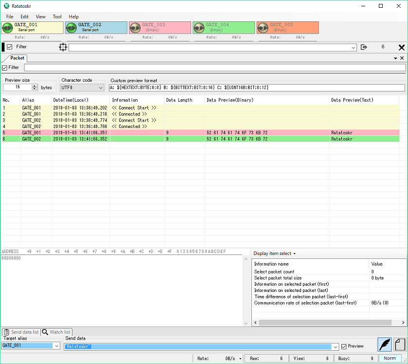
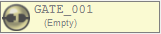
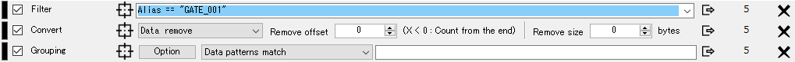

 

# Ratatoskr ユーザーマニュアル

Ratatoskrは、パソコンに接続できる様々なデバイスと通信を行うことができる開発支援ツールです。
シリアルポートやTCP/UDP等の様々な通信ポートに対して、汎用的な通信デバッグ環境を提供します。

見やすいパケットビューや、操作性を重視したインターフェースにより、ポートへの入出力を直感的に操作することができます。

Ratatoskrには以下の特徴があります。

* シリアルポート、TCP/IP、UDP等の様々な通信に対応
  * Serial Port
  * TCP/IP Server or Client
  * UDP
  * USB Capture
* パケット単位やデータ単位など、用途に合わせたパケットビューに対応
* 複数ポートに対しての同時接続
* 複数種類のパケットビューを同時表示
* パケットログの保存/読み込み/自動保存
* フィルタリング、パケット結合等のリアルタイムパケット制御
* ポートからポートへのリダイレクト転送

## 著作権

* Toki.H.K ([https://github.com/tokihk](https://github.com/tokihk))

## ライセンス

　　GPL3 (GNU GENERAL PUBLIC LICENSE v3)

## 動作環境

* .NET Framework 4.7

## インストール

.NET Framworkをインストールした後に、任意のフォルダに解凍して実行してください。

一部の機能を使用するときは他ソフトウェアが必要になります。

| 機能 | 必要ソフトウェア |
| :--- | :--- |
| USB Monitor | USBPcap ([http://desowin.org/usbpcap/](http://desowin.org/usbpcap/ "USBPcap")) |
| Ehernet | WinPcap ([https://www.winpcap.org/](https://www.winpcap.org/)) |

### アンインストール

Ratatoskrはレジストリを使用しません。

インストールで解凍したファイルを削除した後に、設定ファイルを削除してください。
設定ファイルは以下の場所に存在します。
`%APPDATA%\Ratatoskr`

## 基本的な使い方

### 1. パケットビューを追加

`[Menu Bar] -> [View] -> [Add packet view]`　から任意のパケットビューを追加できます。

### 2. ゲートを設定

ゲートバーのボタンからゲートを設定できます。

| アイコン                           | 状態      | 操作方法 |
| :---:                              | :---:     | --- |
|      | 未設定    | マウス左/右クリック: ゲート編集  |
|        | 設定済    | マウス左クリック: 接続/切断 マウス右クリック: ゲート編集 マウス右ホールド: ゲートリセット  |

| アイコン                          | 状態      |
| :---: | :---: |
|    | 接続状態   |
|  | 接続準備中 |
|   | 切断状態   |

### 3. 送信する

フレーム下部にある送信コントロールボックスからデータを送信することができます。

送信先ゲートは`Target alias`にワイルドカードで指定します。

* **エディット送信モード**

    16進数表現で入力し、Enterキーで送信します。
    3文字目もしくはスペースで別データとして認識します。

    `'...'` で囲むと囲まれた文字を文字コードに変換します。
    `<...>` で囲むと文字コードを変更できます。(デフォルトはutf-8)

    `Preview` にチェックを入れると実際に送信するデータを確認できます。

    | 入力データ       | 送信データ               |
    | :---             | :---                     |
    | `0123456789`     | `01 23 45 67 89`         |
    | `0 1 2 3 4`      | `00 01 02 03 04`         |
    | `02'test'03`                      | `02 74 65 73 74 03`      |
    | `02'あいうえお'03`                | `02 E3 81 82 E3 81 84 E3 81 86 E3 81 88 E3 81 8A 03` |
    | `02<shift-jis>'あいうえお'03`     | `02 82 A0 82 A2 82 A4 82 A6 82 A8 03`     |

 

* **ファイル送信モード**

    送信データをドラッグ＆ドロップするか、ファイル選択ダイアログから選択します。
    ※管理者モードのときはドラッグ＆ドロップはできません。
    Enterキーで送信します。

#### 4. 受信する

外部からゲートにデータが入力されると、パケットビューにデータが表示されます。

## 便利な使い方(リアルタイム変換)

Ratatoskrには送信/受信したパケットを、リアルタイムで加工する機能が備わっています。
変換機能は自由に組み合わせができ、データ解析に非常に役立ちます。

変換器は `[Menu Bar] -> [View] -> [Add converter]` から追加します。
追加した変換器はゲートボタンバーの下に追加されていきます。

変換順序は上に配置されている変換器から順番に処理されます。
追加した変換器は左のバーをドラッグすることで順番を入れ替えることができます。

変換器の対象となるパケットは変換機毎に指定できます。
対象パケットを指定しなかった場合は変換機を通過する全パケットが対象です。

### フィルタリング

`[Menu Bar] -> [View] -> [Add converter] - [Filter]`を追加します。

指定したパターンに一致するパケットのみを通過させます。

パターンは `(...)` による優先度指定や条件演算子`&&` `||`により条件を組み合わせることができます。 

| 条件演算子 | 動作 |
| :---       | :--- |
| `A && B`   | AとBの両方の条件を満たしたときに条件を満たします。        |
| `A || B`   | AとBのどちらか一方の条件を満たしたときに条件を満たします。|

パケット要素は以下の変数にて参照できます。(大文字小文字区別なし)
| 変数名          | 内容 | データ型 |
| :---            | :--- | :---     |
| `PacketCount`   | その変換機に到達したパケット数を返します。                     | Number         |
| `LastDelta`     | 直前に到達したパケットとの差分時間を返します。                 | DateTimeOffset |
| `IsControl`     | そのパケットがコントロールパケットかどうかを返します。(未使用) | Bool           |
| `IsMessage`     | そのパケットがメッセージパケットかどうかを返します。           | Bool           |
| `IsData`        | そのパケットがデータパケットかどうかを返します。               | Bool           |
| `Alias`         | そのパケットを作成したゲートのAliasを返します。                | Text           |
| `DateTime`      | そのパケットが発生した時間を返します。                         | DateTime       |
| `Information`   | そのパケットの付加情報を返します。                             | Text           |
| `Mark`          | そのパケットのマーク値を返します。(未使用)                     | Number         |
| `IsSend`        | 送信パケットかどうかを返します。                               | Bool           |
| `IsRecv`        | 受信パケットかどうかを返します。                               | Bool           |
| `Source`        | パケットの送信元情報を返します。                               | Text           |
| `Destination`   | パケットの送信先情報を返します。                               | Text           |
| `DataSize`      | そのパケットのデータサイズを返します。                         | Text           |
| `BitText`       | データ部分を2進数表記で返します。                              | Text           |
| `HexText`       | データ部分を16進数表記で返します。                             | Text           |
| `AsciiText`     | データ部分をASCII表記で返します。                              | Text           |
| `Utf8Text`      | データ部分をUTF-8表記で返します。                              | Text           |
| `UnicodeLText`  | データ部分をUTF-16LE表記で返します。                           | Text           |
| `UnicodeBText`  | データ部分をUTF-16BE表記で返します。                           | Text           |

パラメータ要素は以下の記述で定義できます。
| 型 | 正規表現 | 記述例 |
| :--- | :--- | :--- |
| Number   | `[0]|([1-9][0-9]{0,8})(\.[0-9]{1,8}){0,1}` | `0` `12345` `12345.0123` |
| Number   | `0[xX][0-9a-fA-F]{1,8}`                    | `0x01234567` |
| DateTime | `{TY}-{TM}-{TD}T{Th}:{Tm}:{Ts}\.{Tf}([\+\-]{Th}:{Tm}|Z)` | `2018-01-01T01:00:00.000Z` `2018-01-01T01:00:00.000+09:00` |
| DateTimeOffset | `{Th}:{Tm}:{Ts}\.{Tf}`                    | `00:00:15.123` |
| Text | `\"[^\"]*\"` | `"abcdef"` |
| Regex(正規表現) | `\/[^/]*\/` | `/02.*03/` |
- **Regex型はText型と正規表現で比較できます。**
- 省略記号は以下を表します。
  - `TY = ([0-9]{4})`
  - `TM = ([0][0-9]|1[0-2])`
  - `TD = ([0-2][0-9]|3[0-1])`
  - `Th = ([0-1][0-9]|2[0-3])`
  - `Tm = ([0-5][0-9])`
  - `Ts = ([0-5][0-9])`
  - `Tf = ([0-9]{3})`

よく使う記述例を以下に提示します。
| フィルタ式 | 意味 |
| :--- | :--- |
| `IsData && HexText == /02.*03/` | 02～03で囲まれているデータパケット |

### パケット結合/分割

`[Menu Bar] -> [View] -> [Add converter] - [Grouping]`を追加します。

ルールに従ってパケットを結合したり分割することができます。

* **Data patterns match**

  記述したパターンに一致するデータを検出するまでパケットを結合します。 
  エディット送信モードと同じ記述形式でパターンを入力します。

* **Data size**

  変換機を通過するときに指定サイズのパケットとなって出力されます。

* **Receive timeout**

  変換機へのパケット入力間隔が指定時間以上になるまでパケットが結合されます。

* **Interval**

  変換機へのパケット入力間隔に関わらず、指定間隔でパケットが出力されます。 
  出力されるまでに変換機へ入力されたパケットは結合されます。

### データ変換

`[Menu Bar] -> [View] -> [Add converter] - [Convert]`を追加します。

変換機に入力されたパケットの中身を改変します。

* **Change alias**
  変換機に入力されたパケットのAliasを変更します。

* **Code encode**
  特定のコードを検出したときに前処理用のコードを追加してコードにマスク処理を施します。

* **Code decode**
  TBD

* **Data remove**

  オフセットとサイズを指定してデータの一部を削除します。 
  オフセットを負の値にすると、最後尾からカウントします。

* **Data change**
  指定データを任意のデータに変換します。

