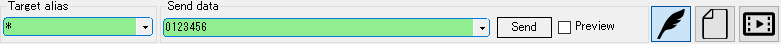

<!--- Update: 2019.03.06 --->
<link href="../params.css" rel="stylesheet"></link>

# Basic Operation

## 1. Gate Setting

At the initial startup, the function is not set on the gate.  
You can set the function from the gate button located at the top to the gate.

Refer to [Gate Device](gate-device.jpn.html) for the assignable functions.

The operation method varies depending on the state of the gate.  
The state of the gate and how to operate are as follows.

| Icon                           | State      | Operation |
| :---:                              | :---:     | --- |
|     | No setup   | Left/Right Click: Edit  |
|  | Configured | Left Click: Connect/Disconnect Right Click: Edit Right Hold: Clear  |

| Icon                          | State      |
| :---: | :---: |
|    | Connected   |
|  | Connecting / Disconnecting |
|   | Disconnected   |

## 2. Data send 

Data can be sent from the transmission control box at the bottom of the frame.

The destination gate is specified with wild card in `Target alias`.

Refer to [Send Mode](send-mode.jpn.html) for how to use each mode.

## 3. パケットビューを追加

`[Menu Bar] -> [View] -> [Add packet view]`　から任意のパケットビューを追加できます。

パケットビューについては[Packet View]を参照してください。

## 4. 受信する

外部からゲートにデータが入力されると、パケットビューにデータが表示されます。

# 便利な使い方

## パケット変換

には送信/受信したパケットを、リアルタイムで加工する機能が備わっています。 
変換機能は自由に組み合わせができ、データ解析に非常に役立ちます。 

変換器は `[Menu Bar] -> [View] -> [Add converter]` から追加します。 
追加した変換器はゲートボタンバーの下に追加されていきます。

割り当て可能な変換器については[Packet Converter]を参照してください。

変換順序は上に配置されている変換器から順番に処理されます。 
追加した変換器は左のバーをドラッグすることで順番を入れ替えることができます。

変換器の対象となるパケットは変換機毎に指定できます。 
対象パケットを指定しなかった場合は変換機を通過する全パケットが対象です。

## プロファイル

ゲート設定、パケットビュー設定、パケット変換設定をプロファイルとして管理し、自由に切り替えることができます。 

メニュー右上のプロファイルメニューで操作します。

## スクリプト

スクリプトでゲート操作を制御することができます。

言語仕様およびサンプルは[Script - Code Style](script-codestyle.jpn.html)を参照してください。

APIインターフェースは[Script - API](script-api.jpn.html)を参照してください。

  
