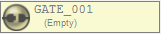
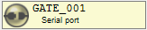

# 基本的な使い方

## 1. パケットビューを追加

`[Menu Bar] -> [View] -> [Add packet view]`　から任意のパケットビューを追加できます。

## 2. ゲートを設定

ゲートバーのボタンからゲートを設定できます。

| アイコン                           | 状態      | 操作方法 |
| :---:                              | :---:     | --- |
|      | 未設定    | マウス左/右クリック: ゲート編集  |
|        | 設定済    | マウス左クリック: 接続/切断 マウス右クリック: ゲート編集 マウス右ホールド: ゲートリセット  |

| アイコン                          | 状態      |
| :---: | :---: |
|    | 接続状態   |
|  | 接続準備中 |
|   | 切断状態   |

## 3. 送信する

フレーム下部にある送信コントロールボックスからデータを送信することができます。

送信先ゲートは`Target alias`にワイルドカードで指定します。

* **エディット送信モード**

    16進数表現で入力し、Enterキーで送信します。
    3文字目もしくはスペースで別データとして認識します。

    `'...'` で囲むと囲まれた文字を文字コードに変換します。
    `<...>` で囲むと文字コードを変更できます。(デフォルトはutf-8)

    `Preview` にチェックを入れると実際に送信するデータを確認できます。

| 入力データ       | 送信データ               |
| :---             | :---                     |
| `0123456789`     | `01 23 45 67 89`         |
| `0 1 2 3 4`      | `00 01 02 03 04`         |
| `02'test'03`                      | `02 74 65 73 74 03`      |
| `02'あいうえお'03`                | `02 E3 81 82 E3 81 84 E3 81 86 E3 81 88 E3 81 8A 03` |
| `02<shift-jis>'あいうえお'03`     | `02 82 A0 82 A2 82 A4 82 A6 82 A8 03`     |

 

* **ファイル送信モード**

    送信データをドラッグ＆ドロップするか、ファイル選択ダイアログから選択します。
    ※管理者モードのときはドラッグ＆ドロップはできません。
    Enterキーで送信します。

## 4. 受信する

外部からゲートにデータが入力されると、パケットビューにデータが表示されます。

# 便利な使い方(リアルタイム変換)

Ratatoskrには送信/受信したパケットを、リアルタイムで加工する機能が備わっています。
変換機能は自由に組み合わせができ、データ解析に非常に役立ちます。

変換器は `[Menu Bar] -> [View] -> [Add converter]` から追加します。
追加した変換器はゲートボタンバーの下に追加されていきます。

変換順序は上に配置されている変換器から順番に処理されます。
追加した変換器は左のバーをドラッグすることで順番を入れ替えることができます。

変換器の対象となるパケットは変換機毎に指定できます。
対象パケットを指定しなかった場合は変換機を通過する全パケットが対象です。
