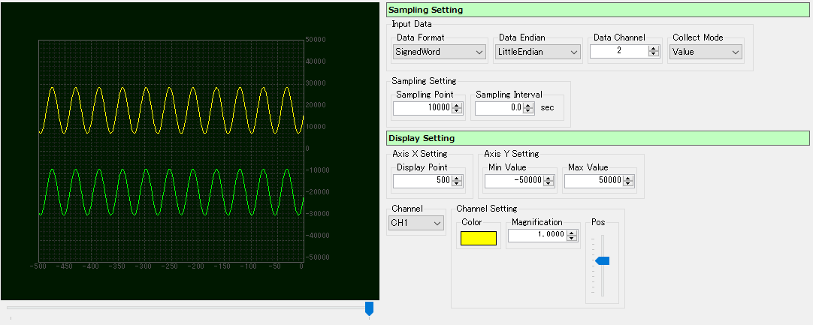

<link href="../params.css" rel="stylesheet" />

# Packet View - Graph

データパケットのデータ部分を定量化してグラフ表示します。 
サンプリング間隔を指定してデータ通信量をグラフ化したり、データを指定サイズで分割してA/D値として表示することができます。 

デバイス内部で取得したA/D値を可視化したり、通信レートを測定することに適したビューです。

## Parameter

### Sampling Setting - Input Data - Data Format

1 Sample/CH データ形式(データサイズ/タイプ)を指定します。 

### Sampling Setting - Input Data - Data Endian

1 Sample/CH データのエンディアンを指定します。

### Sampling Setting - Input Data - Data Channel

1サンプリングあたりのデータチャンネル数を指定します。

### Sampling Setting - Input Data - Collect Mode

### Sampling Setting - Sampling Point

### Sampling Setting - Sampling Interval

### Display Setting - Axis X Setting - Display Point

### Display Setting - Axis Y Setting - Min Value

### Display Setting - Axis Y Setting - Max Value

### Display Setting - Channel

### Display Setting - Channel Setting - Color

### Display Setting - Channel Setting - Magnification

### Display Setting - Channel Setting - Pos

  
