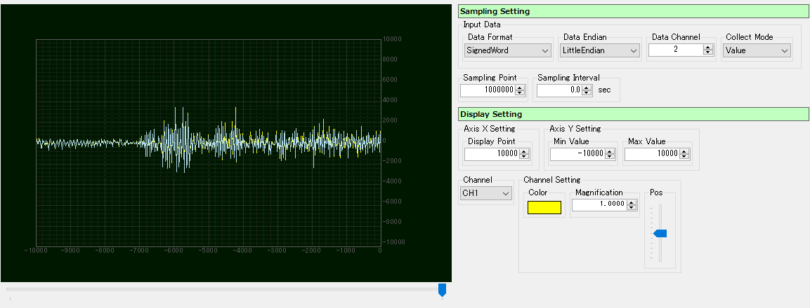

<link href="../params.css" rel="stylesheet" />

# Packet View - Graph

データパケットのデータ部分を定量化してグラフ表示します。 
サンプリング間隔を指定してデータ通信量をグラフ化したり、データを指定サイズで分割してA/D値として表示することができます。 

デバイス内部で取得したA/D値を可視化したり、通信レートを測定することに適したビューです。

## Parameter

### Sampling Setting - Input Data - Data Format

1 Sample/CH データ形式(データサイズ/タイプ)を指定します。 

### Sampling Setting - Input Data - Data Endian

1 Sample/CH データのエンディアンを指定します。

### Sampling Setting - Input Data - Data Channel

1サンプリングあたりのデータチャンネル数を指定します。

### Sampling Setting - Input Data - Collect Mode

データ値の求め方を指定します。 
Value    : 得た値をそのまま使用します。 
ValueSum : 得た値をSampling Interval間隔で合算したものを使用します。 
Count    : 得ることが出来たデータ数を使用します。 

### Sampling Setting - Sampling Point

全データ数を指定します。

### Sampling Setting - Sampling Interval

サンプリング間隔を指定します。 
0を指定した場合は、データ入力毎にサンプリング判定を行います。

### Display Setting - Axis X Setting - Display Point

一度に画面に表示するデータ数を指定します。

### Display Setting - Axis Y Setting - Min Value

縦軸の最小値を指定します。

### Display Setting - Axis Y Setting - Max Value

縦軸の最大値を指定します。

### Display Setting - Channel

設定を行うCH番号を指定します。

### Display Setting - Channel Setting - Color

設定中CHの表示色を指定します。

### Display Setting - Channel Setting - Magnification

設定中CHの表示倍率を指定します。

### Display Setting - Channel Setting - Pos

設定中CHの表示位置を指定します。

  
