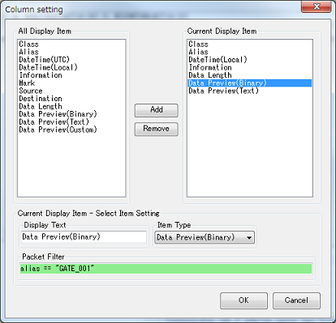

<link href="../params.css" rel="stylesheet" />

# Packet View - Packet

パケット単位でデータを表示します。 
もっとも詳細にデータを表示することができます。 

デバイス通信における通信タイミングや通信シーケンスを確認するのに適したビューです。

## 表示データの設定

パケットビューのヘッダーをクリックすることで、パケットビューに表示するデータを設定できます。 

## Parameter

### Preview size

「Data Preview(Binary)」と「Data Preview(Text)」に表示するデータバイト数です。

### Character code

「Data Preview(Text)」と詳細データウィンドウで使用する文字コードです。

### Custom preview format

記述したテキストを「Data Preview(Custom)」に表示します。 
データ内容を変数として参照でき、データ内容を自身で理解しやすいフォーマットに変換することができます。 

データ内容への参照は以下のように記述することができます。

`${表示形式:解析データタイプ:解析データオフセット:解析データサイズ}`

パケットのデータ部分を「解析データタイプ」で展開し、「解析データオフセット」と「解析データサイズ」で 
変換元データを抽出し、抽出したデータを「表示形式」で出力します。

パケットデータが`00 01 02 03 04 05`の場合の変換例を以下に提示します。

| 変数式 | 表示 |
| ----   | ---- |
| `${HEXTEXT:BYTE:1:2}` | `0102` |
| `${BINTEXT:BYTE:1:2}` | `0000000100000010` |

***表示形式***

| 記述 | 説明 |
| ----   | ---- |
| `HEXTEXT` | 16進数表記 |
| `BITTEXT` | 2進数表記 |
| `ASCII` | ASCII文字列 |
| `UTF8` | UTF8文字列 |
| `UTF16BE` | UTF16(BigEndian)文字列 |
| `UTF16LE` | UTF16(BigEndian)文字列 |
| `SHIFTJIS` | Shift_JIS文字列 |
| `EUCJP` | EucJp文字列 |
| `INT8` | 符号あり8ビット整数 |
| `UINT8` | 符号なし8ビット整数 |
| `INT16LE` | 符号あり16ビット整数(LittleEndian) |
| `INT32LE` | 符号あり32ビット整数(LittleEndian) |
| `INT64LE` | 符号あり64ビット整数(LittleEndian) |
| `UINT16LE` | 符号なし16ビット整数(LittleEndian) |
| `UINT32LE` | 符号なし32ビット整数(LittleEndian) |
| `UINT64LE` | 符号なし64ビット整数(LittleEndian) |
| `INT16BE` | 符号あり16ビット整数(BitEndian) |
| `INT32BE` | 符号あり32ビット整数(BitEndian) |
| `INT64BE` | 符号あり64ビット整数(BitEndian) |
| `UINT16BE` | 符号なし16ビット整数(BitEndian) |
| `UINT32BE` | 符号なし32ビット整数(BitEndian) |
| `UINT64BE` | 符号なし64ビット整数(BitEndian) |

***解析データタイプ***

| 記述 | 説明 |
| ----   | ---- |
| `BYTE` | バイト列で解析します |
| `BIT` | ビット列で解析します |
| `ASCII` | ASCII文字列で解析します |
| `UTF8` | UTF8文字列で解析します |
| `UTF16BE` | UTF16(BigEndian)文字列で解析します |
| `UTF16LE` | UTF16(LittleEndian)文字列で解析します |
| `SHIFTJIS` | Shift_JIS文字列で解析します |
| `EUCJP` | EucJp文字列で解析します |

  
