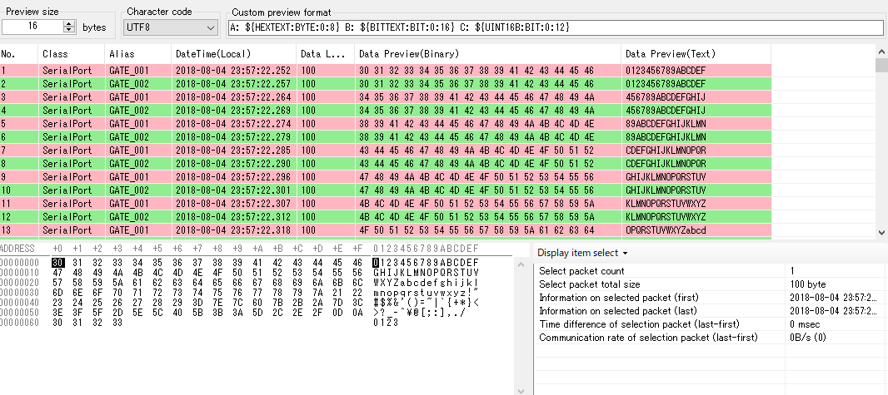
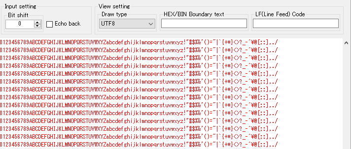

<link href="../params.css" rel="stylesheet" />

# Packet View

## Packet

パケット単位でデータを表示します。 
もっとも詳細にデータを表示することができます。 

デバイス通信における通信タイミングや通信シーケンスを確認するのに適したビューです。

----

## Sequential

データパケットのデータ部分のみをテキスト表示します。 
バイナリデータで表示するか、文字列として表示するかも切り替えることができます。 

デバイスとの簡易データ通信テストに適したビューです。

----

## Graph

データパケットのデータ部分を定量化してグラフ表示します。 
サンプリング間隔を指定してデータ通信量をグラフ化したり、データを指定サイズで分割してA/D値として表示することができます。 

デバイス内部で取得したA/D値を可視化したり、通信レートを測定することに適したビューです。
