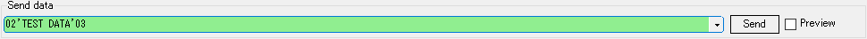
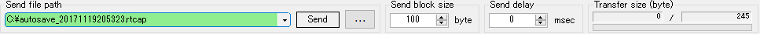

<link href="../params.css" rel="stylesheet" />

# Send Mode

##  エディット送信モード

任意のデータをテキストで指定して送信します。 
16進数表現で入力し、Enterキーで送信します。 
3文字目もしくはスペースで別データとして認識します。 

`Preview` にチェックを入れると実際に送信するデータを確認できます。 

`#1234` のように#で始めると10進数(BigEndian)で認識します。
`'...'` で囲むと囲まれた文字を現在の文字コードで変換します。 
`<...>` で囲むと文字コードを変更できます。(デフォルトはutf-8) 
組込み関数を使用することができます。 

### 組込み関数

#### $(random-int v_min, v_max)

v_minからv_maxの範囲で乱数を返します。 
生成した乱数のデータ長は値に応じて可変します。 

#### $(random-hex len_min, len_max)

len_minからlen_maxの範囲の長さ(byte)のデータを返します。 

#### $(repeat value, count)

valueをcount回繰り返します 

### 入力例

| 入力データ例     | 送信データ               |
| :---             | :---                     |
| `0123456789`     | `01 23 45 67 89`         |
| `0 1 2 3 4`      | `00 01 02 03 04`         |
| `02'test'03`                      | `02 74 65 73 74 03`      |
| `02'あいうえお'03`                | `02 E3 81 82 E3 81 84 E3 81 86 E3 81 88 E3 81 8A 03` |
| `02<shift-jis>'あいうえお'03`     | `02 82 A0 82 A2 82 A4 82 A6 82 A8 03`     |
| `02$(random-hex #1, #5)03` | `02 (1～5バイトのランダムデータ) 03` |
| `02$(repeat 112233, #2)03` | `02 11 22 33 11 22 33 03` |

----

##  ファイル送信モード

任意のファイルをバイナリデータとして送信します。 
送信ブロックサイズを[Block size]に指定します。

送信データをドラッグ＆ドロップするか、ファイル選択ダイアログから選択します。 
※管理者モードのときはドラッグ＆ドロップはできません。 
Enterキーもしくは[Send]ボタンで送信します。 

----

##  ログ再生モード

任意のパケットログをログに記述されているタイミングで送信します。 
パケットログ内のどのデータを送信するかを[Play data type]で指定します。 

キャプチャデータをドラッグ＆ドロップするか、ファイル選択ダイアログから選択します。 
※管理者モードのときはドラッグ＆ドロップはできません。 
Enterキーもしくは[Send]ボタンで送信します。 

  
